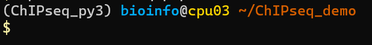
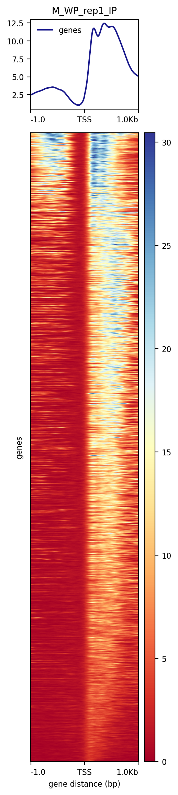

# ChIP-seq pipeline

ChIP-seq 分析脚本在 `~/src/ChIPseq_pipeline.sh` 

## set up

在运行之前，务必确认创建好以下目录结构，以下用`ChIPseq_demo/`作为演示项目目录

```{shell}
mkdir ChIPseq_demo
cd ChIPseq_demo
mkdir -p data/fastq
mkdir results
mkdir src
```

再将示例数据复制在 `data/fastq` 下

```shell
# In ~/ChIPseq_demo
cp ~/data/ChIP-seq_fly_dev/*gz data/fastq/
```

设置好后，目录结构应如下

```shell
ChIPseq_demo/
|-- data
|   -- fastq
|   	`*fastq.gz`
|-- results
|-- src
```

再复制分析脚本到 `src/` 

```shell
# In ~/ChIPseq_demo
cp ~/src/ChIPseq_pipeline.sh src/
```

## run

进入 `ChIPseq_py3` 的分析环境，切换成功后在用户名前有提示

```shell
conda activate ChIPseq_py3
```



运行脚本

> 如果你是通过`srun --nodes=1 --ntasks-per-node=4 --time=04:00:00 --pty bash -I`进入cpu节点的话，在运行`RNAseq_pipeline.sh`时，注意使用的线程数 `-t <num_threads>` 不应超过`--ntasks-per-node`所请求的数目（4）。 

```shell
# In ~/ChIPseq_demo/src
nohup bash ChIPseq_pipeline.sh -d ~/ChIPseq_demo -o ~/ChIPseq_demo/results -i ~/ChIPseq_demo/data --ref ~/reference/fly/index/bowtie2_index/dm6.36/genome -t 32 > nohup1.out 2>&1 &
```

其中，

`-d`: 你的项目目录的（绝对）路径，例如 `~/ChIPseq_demo`

`-o`: 保存结果的目录

`-i`: 测序数据的目录, 保存你的原始fastq (in `<input_data_dir>/fastq`) 和trimmed fastq (in `<input_data_dir>/clean`)

`--ref`: 使用的参考基因组index的路径

`-t`: 使用的线程数，在cpu节点上 (`ssh cpu02~09`)

该脚本执行以下操作：

- quality control (by `trim_galore v0.6.7`)
- mapping (by `bowtie2 v2.4.2 `)
- convert sam to bam, sort and index bam (by `samtools v1.15.1 `)
- convert bam to bigwig files (by `bamCoverage v3.5.1`)
- peak calling (by `macs2 v2.2.7.1`)
- visualization (by `computeMatrix and plotHeatmap v3.5.1`)

## output

运行结束后，在项目目录的 `results` 目录保存运行结果，包括四个目录

```shell
$ ll ~/ChIPseq_demo/results/
total 0
drwxrwxr-x 8 bioinfo bioinfo 4096 Sep 19 21:21 align
drwxrwxr-x 2 bioinfo bioinfo 4096 Sep 19 20:57 peak
drwxrwxr-x 3 bioinfo bioinfo 4096 Sep 19 21:21 QC
drwxrwxr-x 2 bioinfo bioinfo 4096 Sep 19 20:57 vis
```

- QC: 保存每个样本的质控报告

- align: 保存每个样本的比对结果，以及bigwig文件

- peak: 保存每个样本的peaks，以及生物学重复间的overlapping peaks

- vis: 保存每个样本在peak region的信号峰图和热图

例如，WP_rep1 的可视化结果如下




