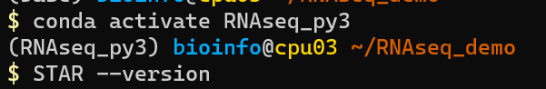
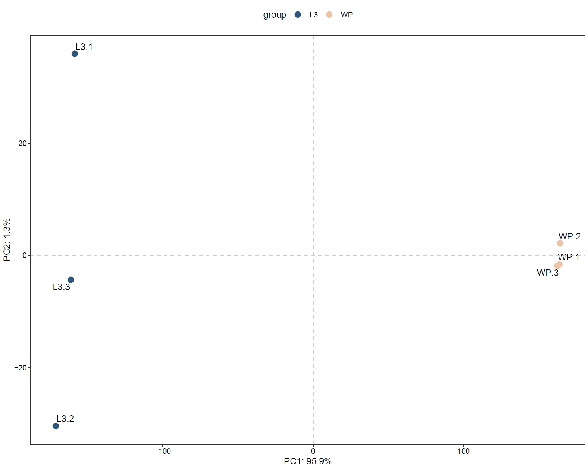
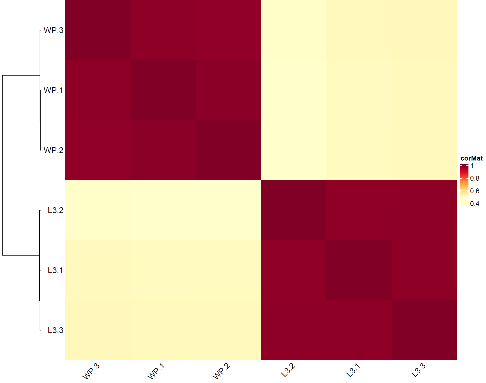
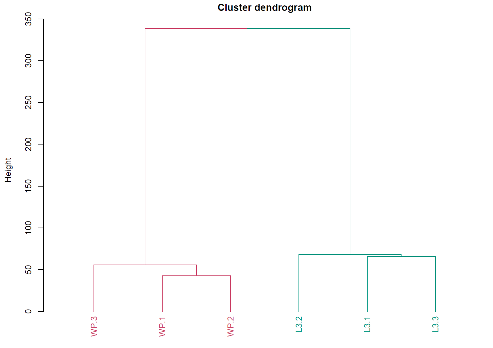
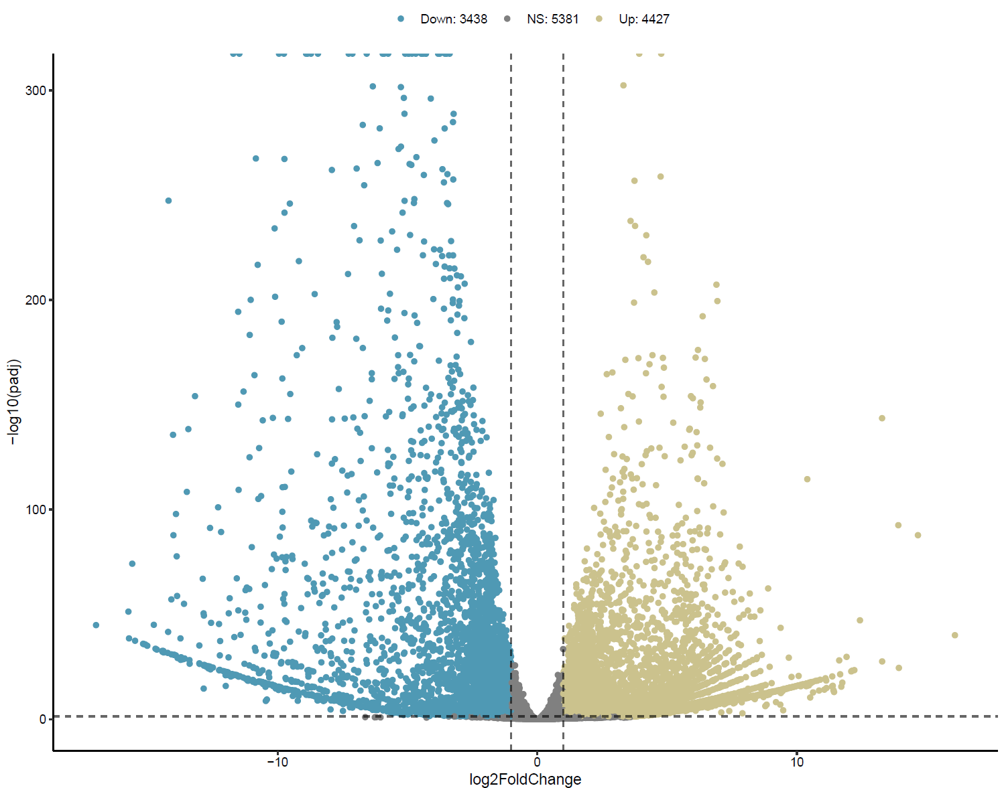
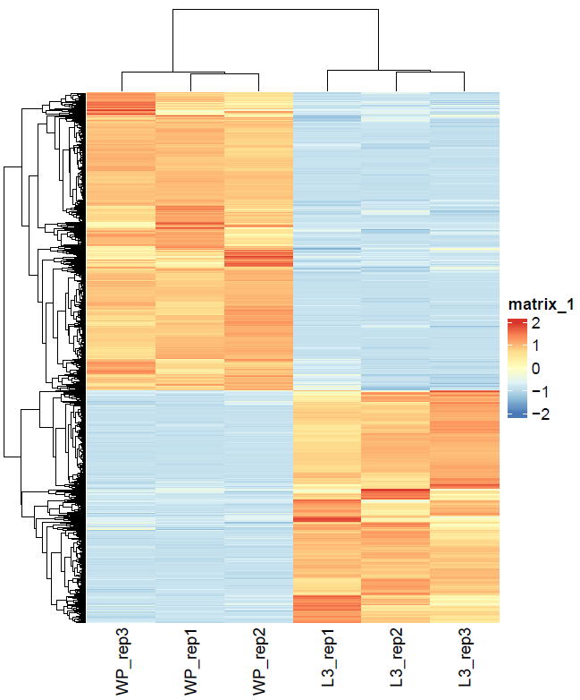
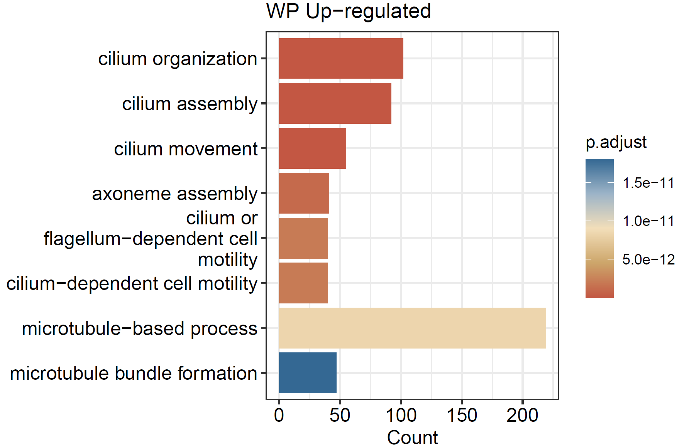
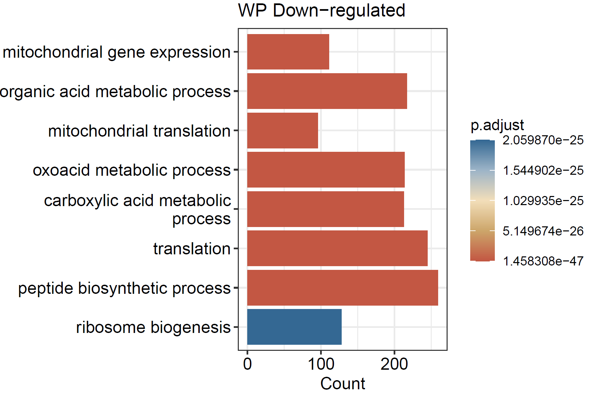

# RNA-seq pipeline

RNA-seq 分析脚本在 `~/src/RNAseq_pipeline.sh` 

## set up

在运行之前，务必确认创建好以下目录结构，以下用`RNAseq_demo/`作为演示项目目录

```{shell}
mkdir RNAseq_demo
cd RNAseq_demo
mkdir -p data/fastq
mkdir results
mkdir src
```

再将示例数据复制到 `data/fastq` 下

```shell
# In ~/RNAseq_demo
cp ~/data/RNA-seq_fly_dev/*gz data/fastq/
```

设置好后，目录结构应如下

```shell
RNAseq_demo/
|-- data
|   -- fastq
|   	`*fastq.gz`
|-- results
|-- src
```

再复制分析脚本到 `src/` 

```shell
# In ~/RNAseq_demo
cp ~/src/RNAseq_pipeline.sh src/
```

## run

进入 `RNAseq_py3` 的分析环境，切换成功后在用户名前有提示

```shell
conda activate RNAseq_py3
```



运行脚本

> 如果你是通过`srun --nodes=1 --ntasks-per-node=4 --time=04:00:00 --pty bash -I`进入cpu节点的话，在运行`RNAseq_pipeline.sh`时，注意使用的线程数 `-t <num_threads>` 不应超过`--ntasks-per-node`所请求的数目（4）。 

```shell
# In ~/RNAseq_demo/src
nohup bash RNAseq_pipeline.sh -d ~/RNAseq_demo -o ~/RNAseq_demo/results -i ~/RNAseq_demo/data --ref ~/reference/fly/index/star_index/dmel_r6.36/ --gtf ~/reference/fly/annotation/dmel-all-r6.36.gtf -t 32 > nohup1.out 2>&1 &
```

其中，

`-d`: 你的项目目录的（绝对）路径，例如 `~/RNAseq_demo`

`-o`: 保存结果的目录

`-i`: 测序数据的目录, 保存你的原始fastq (in `<input_data_dir>/fastq`) 和trimmed fastq (in `<input_data_dir>/clean`)

`--ref`: 使用的参考基因组index的路径

`--gtf`:  所用的基因注释文件 (GTF) 的位置s

`-t`: 使用的线程数，在cpu节点上 (`ssh cpu02~09`)

该脚本执行以下操作：

- quality control (by `trim_galore v0.6.7`)
- mapping (by `STAR v2.7.6a`)
- convert sam to bam, sort and index bam (by `samtools v1.15.1 `)
- gene quantification (by `featureCounts v2.0.1`)

`RNAseq_pipeline.sh` 运行后，可以在服务器直接运行 `DEStream_demo.R` 进行差异基因表达分析, GO富集，及相关可视化

**这里需要激活差异分析的环境 `r_de`，并将样本信息`metadata.csv`和差异分析信息`contrast.csv`复制到项目目录的`src/`**， 例如这里的 `~/RNAseq_demo/src/`

```shell
# In ~/RNAseq_demo
cp ~/src/DEStream_demo.R ~/RNAseq_demo/src/
cp ~/src/metadata.csv ~/RNAseq_demo/src/
cp ~/src/contrast.csv ~/RNAseq_demo/src/
cd ~/RNAseq_demo/src/
conda activate r_de
```

在 `src/` 目录内，运行 `DEStream_demo.R` 

```shell
# In ~/RNAseq_demo/src
Rscript DEStream_demo.R
```

> 差异分析、GO富集和可视化用到的R包：
>
> ```R
> install.packages('tidyverse')
> install.packages('ggrepel')
> install.packages('paintingr')
> install.packages('BiocManager')
> install.packages('dendextend')
> BiocManager::install('DESeq2')
> BiocManager::install('ComplexHeatmap')
> BiocManager::install('clusterProfiler')
> BiocManager::install('org.Dm.eg.db')
> ```


## output

运行结束后，在项目目录的 `results` 目录保存运行结果，包括五个目录和样本的表达矩阵`Counts.csv`

```shell
$ ll ~/RNAseq_demo/results/
total 576
drwxrwxr-x 9 bioinfo bioinfo   4096 Sep 19 14:57 align
-rw-rw-r-- 1 bioinfo bioinfo 565894 Sep 19 14:57 Counts.csv
drwxrwxr-x 2 bioinfo bioinfo   4096 Sep 19 14:33 de
drwxrwxr-x 2 bioinfo bioinfo   4096 Sep 19 14:57 featurecounts
drwxrwxr-x 3 bioinfo bioinfo   4096 Sep 19 14:57 QC
drwxrwxr-x 2 bioinfo bioinfo   4096 Sep 19 14:36 vis
```

- QC: 保存每个样本的质控报告
- align: 保存每个样本的比对结果
- featurecounts: 保存每个样本的定量结果，合并的矩阵在 `results/Counts.csv`
- de: 差异分析结果
  - `DE.RData` 为差异分析结果的RData，可以读取进R中分析 （`load(DE.RData)`）
  - `Res_*.csv` 为未过滤的差异分析结果
  - `Res_*_sig.csv` 为过滤后的显著差异分析结果（**cutoff: |fold-change| >= 2 & adjusted-p < 0.05**）

> `DESeq2` 差异分析的结果如下：
>
> - GeneID: 基因ID
> - baseMean: 基因在所有样本中的平均表达量
> - log2FoldChange: 基因在两组间的表达倍数变化（log2转换）
> - lfcSE: log2FoldChange的standard error
> - stat: 统计检验的统计值
> - pvalue: 统计检验的p-value
> - padj: adjusted p-value，默认是 “Benjamini & Hochberg” 方法
>
> | GeneID                | baseMean | log2FoldChange | lfcSE    | stat     | pvalue   | padj     |
> | --------------------- | -------- | -------------- | -------- | -------- | -------- | -------- |
> | ENSMUSG00000048538.7  | 1244.096 | 1.552698       | 0.391689 | 3.964106 | 7.37E-05 | 0.002497 |
> | ENSMUSG00000067851.11 | 278.8761 | 1.465447       | 0.38467  | 3.80962  | 0.000139 | 0.003611 |
>
> `DE.RData`保存了差异分析的R对象，包括：
>
> - `de`: `DESeq2`差异分析对象
> - `res.ls`: 根据`contrast`提取的各个分组的差异分析结果对象
> - `res.sig.ls`: 根据cutoff过滤后的结果对象
>
> **后面可根据个人需求，对差异分析结果进行进一步分析。**

- vis: 保存可视化结果，具体如下

```shell
$ ls -lh results/vis
total 1.4M
-rw-rw-r-- 1 bioinfo  16K Sep 19 15:37 CorHeatmap.pdf
-rw-rw-r-- 1 bioinfo 426K Sep 19 15:38 DEG_Heatmap.pdf
-rw-rw-r-- 1 bioinfo 6.1K Sep 19 15:38 GO_BP_WP_DOWN_DEG.pdf
-rw-rw-r-- 1 bioinfo 6.2K Sep 19 15:38 GO_BP_WP_UP_DEG.pdf
-rw-rw-r-- 1 bioinfo 4.6K Sep 19 15:37 HClustering.pdf
-rw-rw-r-- 1 bioinfo 5.1K Sep 19 15:37 PCA_PC12.pdf
-rw-rw-r-- 1 bioinfo 765K Sep 19 15:38 VolcanoPlot.pdf
```

包括对样本的质量检测：`PCA_PC12.pdf`, `CorHeatmap.pdf` and `HClustering.pdf`

对差异基因的可视化：` VolcanoPlot.pdf` and `DEG_Heatmap.pdf`

对显著差异表达基因GO富集结果的可视化：`GO_BP_WP_UP_DEG.pdf` and `GO_BP_WP_DOWN_DEG.pdf`

----

### PCA



### Corelation heatmap



### Hierachical clustering



### DEGs Volcano plot



### DEGs heatmap



### GO barplot





