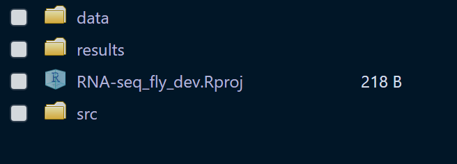
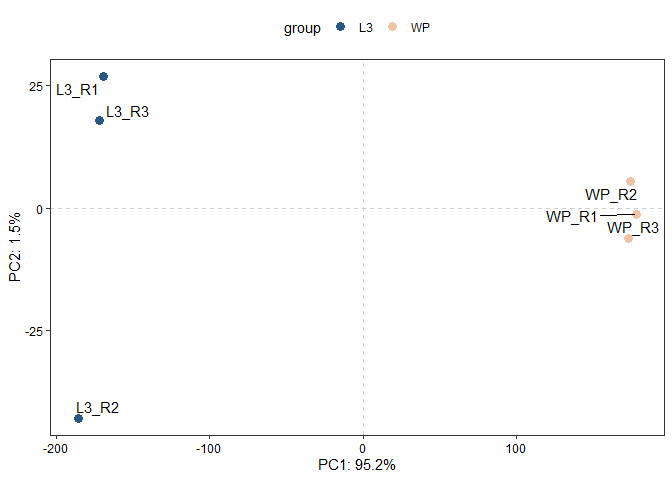
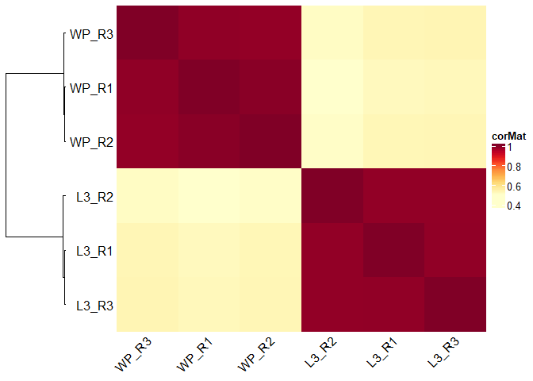
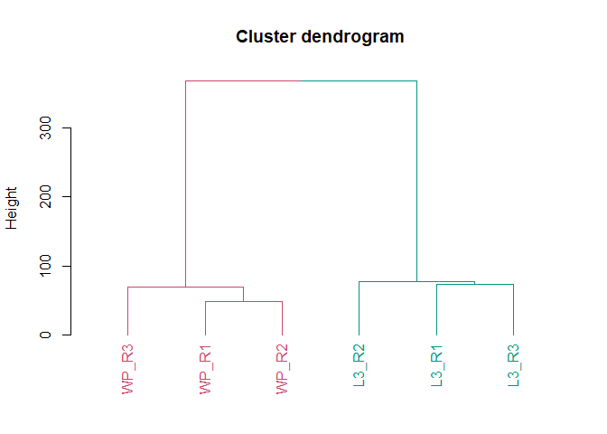
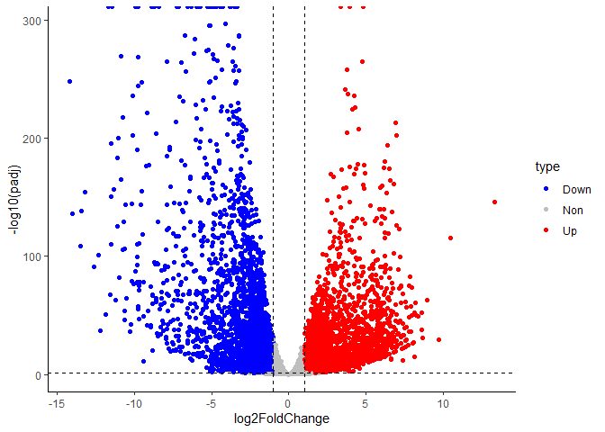

step05_DEG_analysis_R
================

## Set up

在开始差异表达分析之前，我们需要先将服务器上运行的结果下载到本地电脑中。

**在本地电脑上**，首先创建一个项目文件夹
`RNA-seq_fly_dev/`。在其中分别创建三个文件夹 `data/`, `results` and
`src/`，并在其中创建一个R project文件。

创建好后，`RNA-seq_fly_dev/`的结构为下图这样：



接着，打开Rproj文件，RStudio会直接以当前目录为工作目录，后续分析都在RStudio上完成。

## Install Packages

安装分析所需要用到的R包

``` r
install.packages('BiocManager')
install.packages('tidyverse')
install.packages('ggrepel')
install.packages('dendextend')
install.package('paintingr')
BiocManager::install('DESeq2')
BiocManager::install('ComplexHeatmap')
```

``` r
library(tidyverse)
library(DESeq2)
library(ComplexHeatmap)
library(dendextend)
library(ggrepel)
source('src/helper.R')
```

## Merge count files

首先，我们在 `data/` 文件夹中创建 `featurecounts/`
文件夹以保存featureCounts的输出文件。

从计算平台上下载 `results/featurecounts/`
目录下所有的counts.txt到本地电脑的 `RNA-seq_fly_dev/data/featurecounts/`
中。

接着，合并featureCounts输出的多个counts.txt文件为一个counts矩阵，其中每一行代表一个基因，每一列代表一个样本。

``` r
files_path <- list.files('data/featurecounts/', full.names = TRUE)
counts_df <- map_dfc(files_path, function(x) {
  read.table(x, sep = '\t', row.names = 1, skip = 2,
             colClasses = c('character',rep('NULL',5),'integer'))
})
```

    ## New names:
    ## * `V7` -> `V7...1`
    ## * `V7` -> `V7...2`
    ## * `V7` -> `V7...3`
    ## * `V7` -> `V7...4`
    ## * `V7` -> `V7...5`
    ## * `V7` -> `V7...6`

``` r
colnames(counts_df) <- c('L3_R1', 'L3_R2', 'L3_R3', 'WP_R1', 'WP_R2', 'WP_R3')
head(counts_df)
```

    ##             L3_R1 L3_R2 L3_R3 WP_R1 WP_R2 WP_R3
    ## FBgn0031081    74   131   105   284   164   168
    ## FBgn0052826     0     0     0     0     0     0
    ## FBgn0031085     4     0     3   558   363   336
    ## FBgn0062565     0     0     0     1     0     0
    ## FBgn0031088     1     2     3   114    55    69
    ## FBgn0041626     0     0     0     0     0     0

保存counts矩阵

``` r
write.table(counts_df, file = 'data/Counts.csv', sep = ',', col.names = NA)
```

## Filtering low-expressed genes

这里我们保留至少在75%文库都检测都一个count的基因

``` r
keep <- rowSums(counts_df > 1) >= 0.75*ncol(counts_df)
counts_keep <- counts_df[keep,]
dim(counts_df);dim(counts_keep)
```

    ## [1] 17612     6

    ## [1] 10554     6

## Quality control

我们使用三种非监督的方法检验样本之间的重复性，以及是否有潜在的离群样本。

### PCA

``` r
# perform vst transformation
vt <- vst(as.matrix(counts_keep))
samples_group <- rep(c('L3', 'WP'), each=3)
pcaplot1 <- ggPCA(vt, group = samples_group, label = colnames(vt))
if (!dir.exists('results/qc')) { dir.create('results/qc') }
# save the plot
ggsave(plot = pcaplot1,  filename = 'results/qc/PCA_PC12.png', width = 10, height = 8)
pcaplot1
```

<!-- -->

### Correlation

``` r
corp1 <- corHeatmap(vt, col.names = colnames(vt), row.names = colnames(vt))
png(file='results/qc/CorHeatmap.png', bg='white', width=10, height=8, res=300, units='in')
ComplexHeatmap::draw(corp1)
dev.off()
```

    ## png 
    ##   2

``` r
ComplexHeatmap::draw(corp1)
```

<!-- -->

### Hierarchical Clustering

``` r
n.cond <- length(unique(samples_group))
# perform hierarchical cluseting
clust1 <- hclust(dist(t(vt)))
hcp1 <- as.dendrogram(clust1) %>% 
    dendextend::color_branches(k = n.cond) %>% # color brachches of dendrogram 
    dendextend::color_labels(k = n.cond) %>% # color labels of dendrogram
    plot(ylab='Height', main = 'Cluster dendrogram')
```

<!-- -->

``` r
png('results/qc/HClustering.png', width=10, height=8, res=300, units='in')
par(mar = c(8,4.5,2,2)) # tune the margin of plot
hcp1
```

    ## NULL

``` r
dev.off()
```

    ## png 
    ##   2

``` r
hcp1
```

    ## NULL

## Differential analysis by DESeq2

``` r
# construct sample information table for DESeq2
coldatas <- data.frame(condition = samples_group, row.names = colnames(counts_keep))
coldatas
```

    ##       condition
    ## L3_R1        L3
    ## L3_R2        L3
    ## L3_R3        L3
    ## WP_R1        WP
    ## WP_R2        WP
    ## WP_R3        WP

``` r
# construct DESeqDataSet object
dds <- DESeqDataSetFromMatrix(countData = counts_keep,
                              colData = coldatas,
                              design = ~ condition)
dds
```

    ## class: DESeqDataSet 
    ## dim: 10554 6 
    ## metadata(1): version
    ## assays(1): counts
    ## rownames(10554): FBgn0031081 FBgn0031085 ... FBgn0002563 FBgn0046113
    ## rowData names(0):
    ## colnames(6): L3_R1 L3_R2 ... WP_R2 WP_R3
    ## colData names(1): condition

``` r
# perform differential analysis
de <- DESeq(dds)
```

    ## estimating size factors

    ## estimating dispersions

    ## gene-wise dispersion estimates

    ## mean-dispersion relationship

    ## final dispersion estimates

    ## fitting model and testing

``` r
de
```

    ## class: DESeqDataSet 
    ## dim: 10554 6 
    ## metadata(1): version
    ## assays(4): counts mu H cooks
    ## rownames(10554): FBgn0031081 FBgn0031085 ... FBgn0002563 FBgn0046113
    ## rowData names(22): baseMean baseVar ... deviance maxCooks
    ## colnames(6): L3_R1 L3_R2 ... WP_R2 WP_R3
    ## colData names(2): condition sizeFactor

Extract differential analysis results

``` r
res_WPvL3 <- results(de, contrast = c('condition', 'WP', 'L3'))
res_WPvL3
```

    ## log2 fold change (MLE): condition WP vs L3 
    ## Wald test p-value: condition WP vs L3 
    ## DataFrame with 10554 rows and 6 columns
    ##              baseMean log2FoldChange     lfcSE        stat       pvalue
    ##             <numeric>      <numeric> <numeric>   <numeric>    <numeric>
    ## FBgn0031081  141.6122      0.0844967  0.206546    0.409094  6.82470e-01
    ## FBgn0031085  151.5283      6.5849829  0.565180   11.651119  2.26465e-31
    ## FBgn0031088   29.2839      4.3877492  0.652545    6.724054  1.76737e-11
    ## FBgn0040784   14.1219      1.5673812  0.570431    2.747714  6.00123e-03
    ## FBgn0031080   21.4555     -2.5337279  0.465011   -5.448748  5.07257e-08
    ## ...               ...            ...       ...         ...          ...
    ## FBgn0010583  510.6945       0.729475  0.145431   5.0159363  5.27758e-07
    ## FBgn0020545  661.8167      -2.649200  0.119964 -22.0832321 4.58124e-108
    ## FBgn0031289   17.1173      -2.833270  0.573044  -4.9442421  7.64407e-07
    ## FBgn0002563 5942.3953       0.106314  1.237699   0.0858964           NA
    ## FBgn0046113   99.6376      -3.028391  0.257833 -11.7455316  7.44528e-32
    ##                     padj
    ##                <numeric>
    ## FBgn0031081  7.18082e-01
    ## FBgn0031085  1.14273e-30
    ## FBgn0031088  4.31450e-11
    ## FBgn0040784  8.51689e-03
    ## FBgn0031080  1.03473e-07
    ## ...                  ...
    ## FBgn0010583  1.01639e-06
    ## FBgn0020545 1.16982e-106
    ## FBgn0031289  1.45750e-06
    ## FBgn0002563           NA
    ## FBgn0046113  3.80601e-31

consider significant differential expression as genes with absolute
fold-change greater than 2 and adjusted p-value \< 0.05

``` r
res_df <- as.data.frame(res_WPvL3)
res_WPvL3_sig <- subset(res_df, abs(log2FoldChange) >= 1 & padj < 0.05)

dim(res_df);dim(res_WPvL3_sig)
```

    ## [1] 10554     6

    ## [1] 5657    6

## Visualization

### volcano plot

``` r
res_df %>% 
  mutate(type = if_else(padj > 0.05, 'Non', 
                        if_else(log2FoldChange >= 1, 'Up', 
                                if_else(log2FoldChange <= -1, 'Down', 'Non')), missing='Non')
         ) %>%
  ggplot(aes(x=log2FoldChange, y=-log10(padj))) +
  geom_point(aes(color=type)) +
  geom_vline(xintercept = c(-1,1), lty = 'dashed') +
  geom_hline(yintercept = -log10(0.05), lty = 'dashed') +
  theme_classic() +
  scale_color_manual(values = c('blue', 'grey', 'red'))
```

    ## Warning: Removed 8 rows containing missing values (geom_point).

<!-- -->

``` r
ggsave('results/vis/VolcanoPlot.png', width = 10, height = 8)
```

    ## Warning: Removed 8 rows containing missing values (geom_point).
